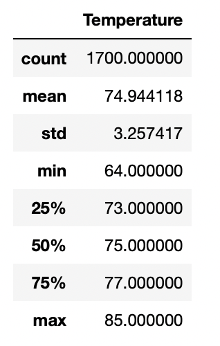
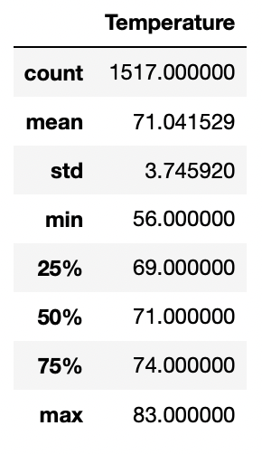

# __Surfs up__

## __Purpose:__

The purpose of this analysis is to study weather data at a specific location in Oahu, to determine if it is an apporpriate location to start up a Surf and ice cream business by a client.

## __Result:__

From the analysis of weather data for the months of June and December at Oahu, across several years, the following can be observed:

- The average temperature in June is 74.9 degrees fahrenheit while the average in December is 71 degrees Fahrenheit.
- The standard deviation in the month of June is 3.26, while in December it is 3.75.
- The month of June has a minimum temperature of 64F and a maximum of 85F, while December has a minimum of 56F and a maximum of 83F.

The summary statistics for the temperatures in the months of June and December can be seen from the images below:

### __Temperature statistics for June__

### __Temperature statistics for December__

## __Analysis:__

From the results it can be observed that there is very little difference in the average temperatures between June and December. The standard deviation from the mean is also nearly the same for both months.The low standard deviation shows that the temperatures are more clustered around the mean, for both months. 

The temperature range - difference between the minimum and maximum temperature is slightly higher in December than in June because of lower minimum temperature in December.

From this it can be undestood that both June and December present nearly the same average temperature conditions. While in December the minimum remperature may be lower, as the day progresses, the temperatures do get warmer with maximum temperatures reaching upto 83 degrees. 

This signifies that the temperatures remain favorable for an ice cream and surf shop throughout the year - both in summer and winter months.

The following additional queries can be written to study weather conditions:

### __Precipitation Data:__

### __Temperature observations near preferred location:__